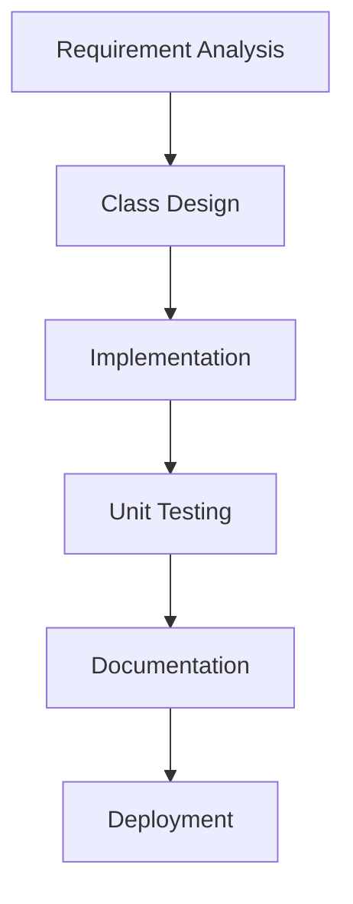

# Ultimate Java Mastery Prompt

## Learning Structure
**Progressive Pathway**  
`Syntax → OOP → Algorithms → Design Patterns → Professional Tools → Real Projects`

## Core Components
1. **Fundamental Building Blocks**  
   - Data types & operators  
   - Control flow (if-else, loops)  
   - Basic I/O operations  
   ```java
   // Example: Conditional logic with input
   Scanner sc = new Scanner(System.in);
   System.out.print("Enter age: ");
   int age = sc.nextInt();
   System.out.println(age >= 18 ? "Adult" : "Minor");
   ```

2. **Object-Oriented Architecture**  
   - Class design & inheritance  
   - Polymorphism & abstraction  
   - Exception handling chains  
   ```java
   abstract class Vehicle {
       abstract void startEngine();
   }
   
   class Car extends Vehicle {
       @Override
       void startEngine() {
           System.out.println("Combustion initiated");
       }
   }
   ```

3. **Advanced Java Features**  
   - Stream API & lambda expressions  
   - Concurrency (Threads/Executors)  
   - Modern features (Records, Pattern Matching)  
   ```java
   List<String> filtered = items.stream()
       .filter(item -> item.length() > 5)
       .collect(Collectors.toList());
   ```

4. **Professional Patterns**  
   - SOLID principles  
   - Microservices architecture  
   - Spring Framework basics  
   ```java
   @Service
   public class UserService {
       @Autowired
       private UserRepository repo;
       
       public User createUser(UserDto dto) {
           return repo.save(new User(dto));
       }
   }
   ```

## Project Development Flow


## GitHub README Template
````artifact
id: readme_template
name: Professional README
type: markdown
content: |-
  # Project Title
  
  ## Architecture Diagram
  ```mermaid
  classDiagram
    Class01 <|-- Implementation : Inheritance
    Class01 : +main()
  ```
  
  ## Development Guide
  1. Environment Setup:
     - JDK 21+
     - Maven/Gradle
  
  2. Quality Standards:
     - 80%+ test coverage
     - Spotbugs validation
     - CI/CD pipeline
  
  ## Contribution Matrix
  | Task Type       | Complexity | Time Estimate |
  |-----------------|------------|---------------|
  | Bug Fix         | Low        | 2-4 hours     |
  | Feature Add     | Medium     | 1-3 days      |
  | Architecture    | High       | 1-2 weeks     |


Project Title
Architecture Diagram
classDiagram
  Class01 <|-- Implementation : Inheritance
  Class01 : +main()
Development Guide
Environment Setup:

JDK 21+
Maven/Gradle
Quality Standards:

80%+ test coverage
Spotbugs validation
CI/CD pipeline
Contribution Matrix
Task Type	Complexity	Time Estimate
Bug Fix	Low	2-4 hours
Feature Add	Medium	1-3 days
Architecture	High	1-2 weeks
